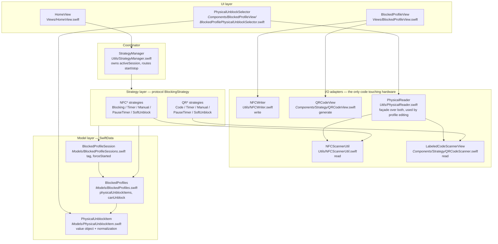
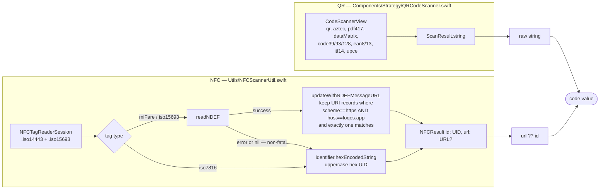
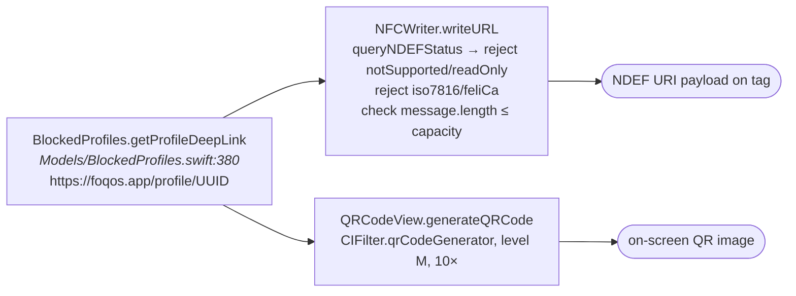
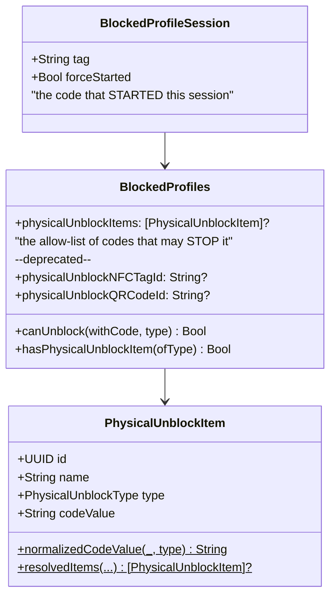
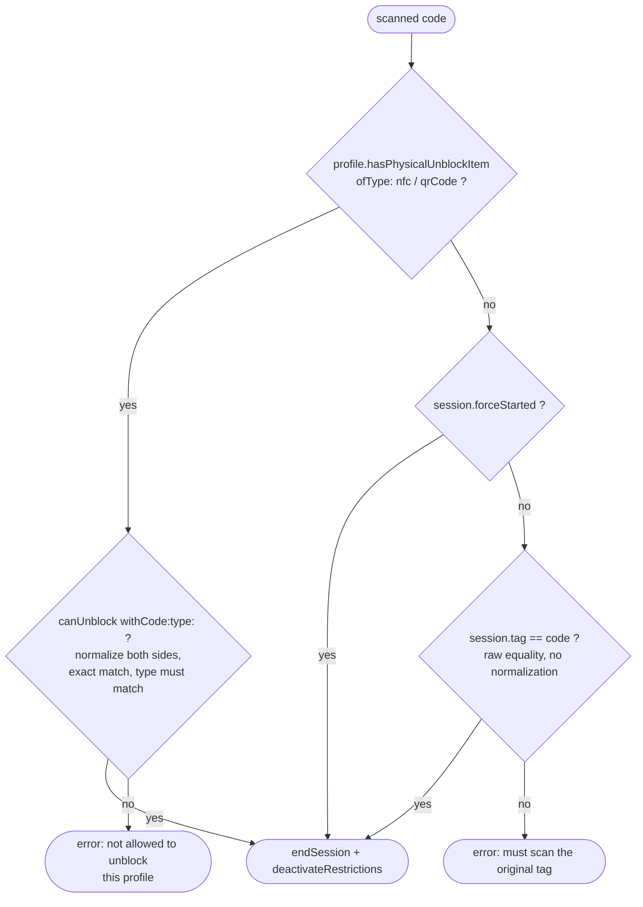
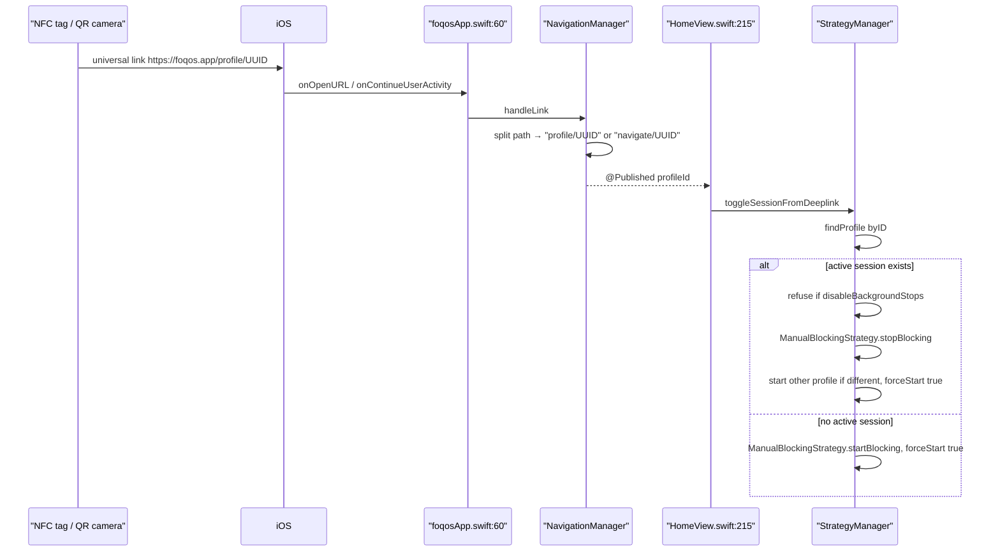

# Physical Code Flows (NFC + QR)

How Foqos reads, writes, stores, and compares NFC tags and QR/barcodes.
Every node below names the file that owns it, so this doubles as a map of where to edit.

---

## 1. The pattern in one picture

The whole feature is the **Strategy pattern** with two swappable I/O adapters
underneath it, plus a **normalize-then-compare** value object for the codes.



**The contract that makes it swappable** — `Models/Strategies/BlockingStrategy.swift`:

```swift
func startBlocking(context:profile:forceStart:) -> (any View)?
func stopBlocking(context:session:)             -> (any View)?
```

Returning `View?` is the key design decision. QR strategies return a scanner view that
`StrategyManager.presentCustomStrategyView` puts on screen; NFC strategies return `nil`
because CoreNFC presents its own system sheet. Same call site, two very different UIs.

---

## 2. Read paths — where a "code" comes from



Two things worth knowing before you edit here:

- `result.url ?? result.id` — **a foqos.app URL always beats the hardware UID.** Same
  physical tag yields a different code value before vs. after you write a profile to it.
- The QR side is a superset of QR: barcodes are accepted everywhere QR is.

---

## 3. Write / generate path



`NFCScannerUtil.writeURL` is a **dead second implementation** using `NFCNDEFReaderSession`;
nothing wires to it. Delete it or keep it in mind so you don't edit the wrong one.

---

## 4. Storage — two stores, easy to conflate



- **Session tag** is written once at `createSession(in:withTag:…)`, **unnormalized**.
- **Allow-list** is normalized on the way in *and* on every comparison.
  `normalizedCodeValue` trims always; for `.qrCode` only, it lowercases scheme + host and
  drops a bare trailing `/`. NFC values get trimming only.
- Legacy single-code fields are folded into the array on launch by
  `Models/Migrations/BlockedProfilesMigration.swift`, then nil'd.

---

## 5. Stop-time comparison — the rule every strategy repeats



Consequences to keep in mind when editing:

- An allow-list **replaces** the same-code rule for that type. Any listed code stops the
  session; the original session tag stops mattering.
- The two branches use different equality: normalized in the allow-list branch, raw in
  the fallback branch.
- `forceStarted` — set by deep-link and background/Shortcut starts — skips the check entirely.

This block is duplicated in all ten strategies. If you change the rule, change it in each
of `Models/Strategies/{NFC,QR}*BlockingStrategy.swift`, or hoist it into
`BlockingStrategy`'s protocol extension first.

---

## 6. The tap-to-toggle path bypasses all of the above



No scanner and **no code comparison** runs here — possession of the URL is the entire
authorization, and the session it creates is `forceStarted`, so it is later exempt from
the same-code rule too.

---

## 7. File map

| Concern | File |
| --- | --- |
| NFC read | `Foqos/Utils/NFCScannerUtil.swift` |
| NFC write | `Foqos/Utils/NFCWriter.swift` |
| QR/barcode read | `Foqos/Components/Strategy/QRCodeScanner.swift` |
| QR generate | `Foqos/Components/Strategy/QRCodeView.swift` |
| Read façade for profile editing | `Foqos/Utils/PhysicalReader.swift` |
| Strategy contract | `Foqos/Models/Strategies/BlockingStrategy.swift` |
| Strategy implementations | `Foqos/Models/Strategies/{NFC,QR}*.swift` |
| Routing / active session | `Foqos/Utils/StrategyManager.swift` |
| Code value + normalization | `Foqos/Models/PhysicalUnblockItem.swift` |
| Allow-list + `canUnblock` | `Foqos/Models/BlockedProfiles.swift` |
| Session tag + `forceStarted` | `Foqos/Models/BlockedProfileSessions.swift` |
| Legacy field migration | `Foqos/Models/Migrations/BlockedProfilesMigration.swift` |
| Allow-list editing UI | `Foqos/Components/BlockedProfileView/BlockedProfilePhysicalUnblockSelector.swift` |
| Deep-link entry | `Foqos/foqosApp.swift`, `Foqos/Utils/NavigationManager.swift` |
